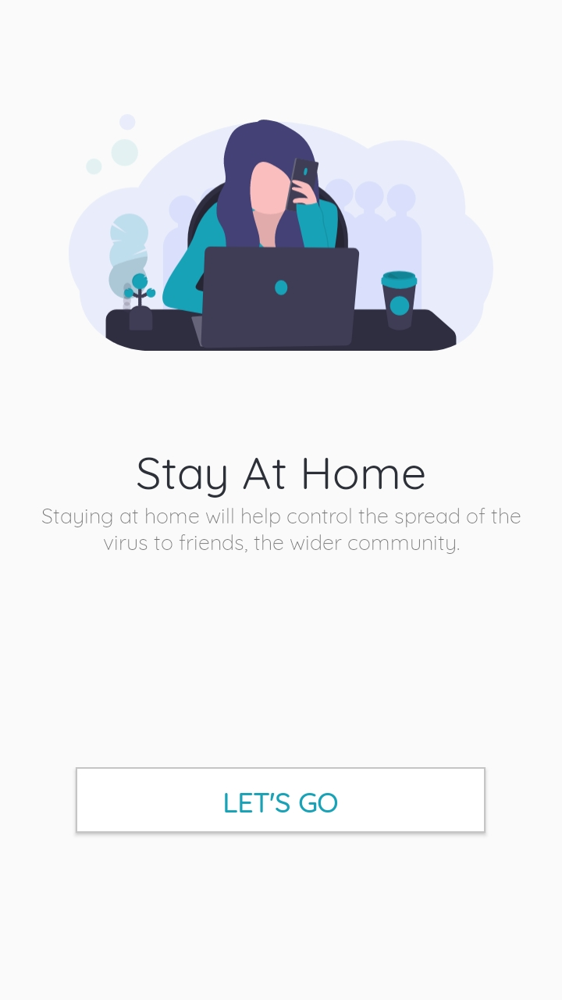

# Complete-Corona-Tracking-Android-App
CORONA STATS mobile app is an innovation to make it easier for users to be aware of the coronavirus statistics both globally and locally, based on the API from (https://disease.sh). This is a GitHub project that collects COVID19 data and makes it available through different formats.

Screenshots comming Soon 

              

Apk Download
Comming soon

_______________________________________________________________
